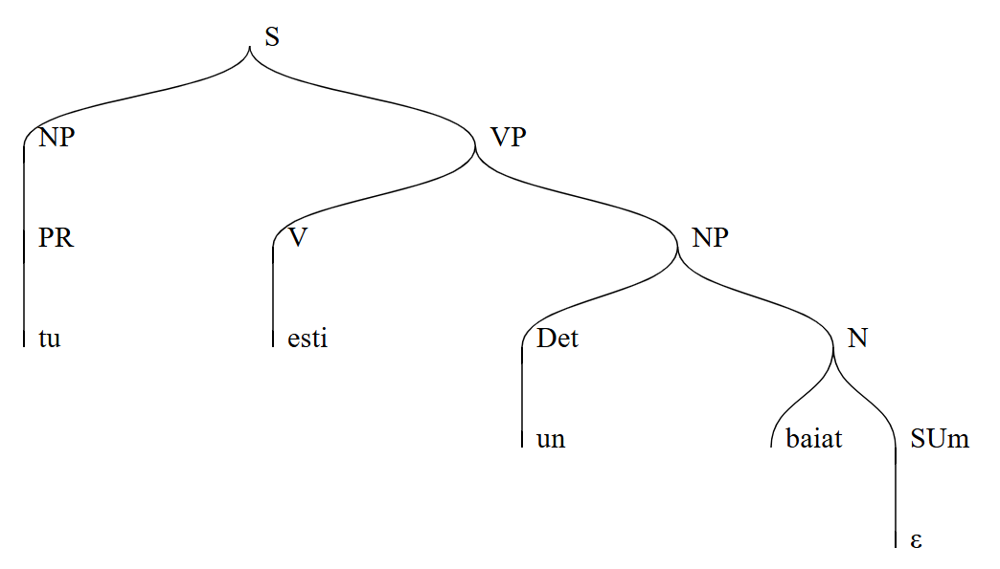
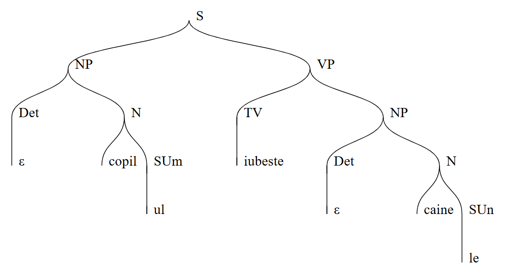
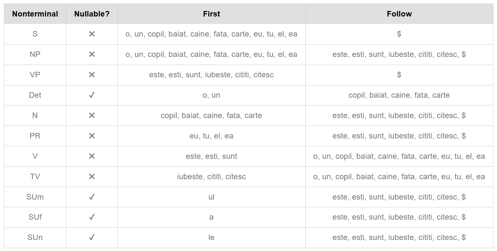
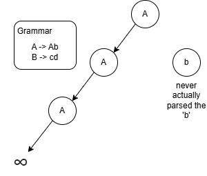
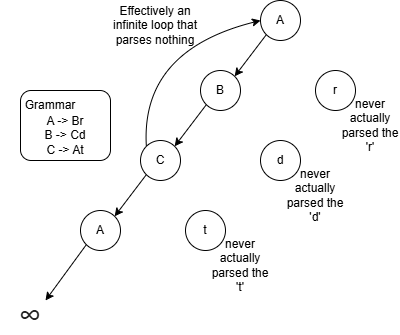
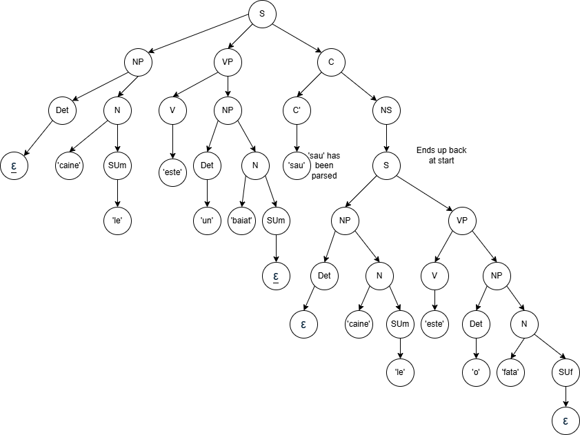

# Evidence 2: Generating and Cleaning a Restricted Context Free Grammar

## Overview

The goal of this project is to create an LL1 parser for a context-free grammer.
It will be based on a real other language, and be modeled, 'cleaned',
and implemented and tested in prolog, famously a great language for creating 
your own parser.
[Davis S. Warren, Grammars in Prolog](https://www3.cs.stonybrook.edu/~warren/xsbbook/node10.html)

## Description

This grammar will be based on Romanian, the language spoken in Romania of eastern 
Europe. Romanian is quite like English in that it uses the SVO (subject-verb-object) 
order of words, and even more like Spanish in how the nouns have genders and how the
verbs are conjugated. This makes sense as they are both latin-based romance languages.
[Romanian Word Order](https://www.romanianpod101.com/blog/2020/08/07/romanian-word-order/)

For example, for the basic English sentences: "I have a book", and "You have a dog",
the verb stays the same, and both nouns receive the same indefinite article 'a'.
But like spanish, the article depends on the gender of the noun, and verb is conjugated:
    yo tengo un libro -> eu am o carte
    tú tienes un perro -> tu aveti un caine

However, the definite article, like 'the' in English, is more complicated. It often 
gets attached as a suffix to the noun, like this:
    boy -> băiat; the boy -> băiatul, or dog -> câine ; the dog -> câinele

<!-- Romanian is more similar to Spanish than English. However, the verb conjugations, 
genderization of indefinite articles, and definite articles being sometimes attached
to the noun will make it hard to construct a restrictive language like a CFG. -->

## Models

The following set of production rules, abiding by the laws of a type 2 language (all 
left hand side may only have one non-terminal), allow the formation of some basic 
sentences with correct SVO structure and grammar in Romanian:

S -> NP VP
NP -> Det N | PR
VP -> V | TV NP
Det -> o | un | ε
N -> copil SUm | baiat SUm | caine SUn | fata SUf | carte SUf
PR -> eu | tu | el | ea
V -> este | esti | sunt
TV -> iubeste | cititi | citesc
SUm -> ul | ε
SUf -> a | ε
SUn -> le | ε

As you can see, with the above production rules, you can generate some sentences like:
1. you are a boy -> tu esti un baiat


2. the child loves the dog -> copilul iubeste cainele


### Eliminating Ambiguity

Ambiguity in a set of production rules is when there are multiple ways to parse the input 
string, creating different trees with identical results. An example could be if somehow, 
with an input string of 'she is a girl', there were two or more ways of parsing the rules 
to arrive at that string.
[Ambiguous Grammars](https://www.geeksforgeeks.org/ambiguous-grammar/)

Common ambiguities seem to be:
1. When the possibilities of a non-terminal all start with the same terminal: A -> aB | aC, in which you would need left factoring to fix it:
 
- 'In left factoring, we separate the common prefixes from the production rule'
- You end up with A -> aA' ; B -> b ; C -> c
- [Left Factoring](https://www.naukri.com/code360/library/left-factoring-in-compiler-design)

2. If the same non-terminal appears in both the FIRST and FOLLOW set of a non-terminal.
However, with my grammar, that is not the case:


### Eliminating Left Recursion

Left recursion in a grammar is when a non-terminal calls itself as the first thing it produces,
which leads to an infinite loop and no progres (direct), or if the flow of non-terminals arrives 
back at itself, again, without having actually parsed anything.
[Removing Left Recursion](https://www.geeksforgeeks.org/removing-direct-and-indirect-left-recursion-in-a-grammar/)

I made the following diagrams to illustrate these two kinds of left recursion:

1. Direct Left Recursion 

2. Indirect Left Recursion 

In my case, once again, there is no present left recursion. There's never even a case in which
a single path can encounter the same non-terminal twice, the current grammar is very finite.

Even if I added recursivity, by allowing compound sentences using words like 'and' or 'or',
and permitting that a sentence may have multiple SVO components, there is still no instance
in which left recursion is a problem:

S -> NP VP **C**           // new non-terminal 'C'
NP -> Det N | PR
VP -> V | TV NP
C -> C' NS                 // new line
C' -> si | sau             // new line
NS -> NP | S               // new line
Det -> o | un | ε
N -> copil SUm | baiat SUm | caine SUn | fata SUf | carte SUf
PR -> eu | tu | el | ea
V -> este | esti | sunt
TV -> iubeste | cititi | citesc
SUm -> ul | ε
SUf -> a | ε
SUn -> le | ε

Despite it now being recursive in that a sentence can, through a conjunction, arrive at a whole 
new sentence, it is not left recursive because there is progress being made before it arrives at 
itself again, as demonstrated with the following example:

    the dog is a boy or the dog is a girl -> cainele este un baiat sau cainele este o fata



## Implementation

In order to test this grammar, the declaritive programming language Prolog, which many consider
to be a built in parser with its rule-and-fact-setting ability and which was originally programmed
to write natural language applications, will be used to define the production rules of the grammar.

    ```prolog
    s --> np, vp.
    np --> det, n.
    np --> pr.
    vp --> v.
    vp --> tv, np.
    det --> [o].
    det --> [un].
    det --> [].
    n --> [copil], sum.
    n --> [baiat], sum.
    n --> [caine], sun.
    n --> [femeie], suf.
    n --> [carte], suf.
    pr --> [eu].
    pr --> [tu].
    pr --> [el].
    pr --> [ea].
    v --> [este].
    v --> [esti].
    v --> [sunt].
    tv --> [iubeste].
    tv --> [cititi].
    tv --> [citesc].
    sum --> [ul].
    sum --> [].
    sun --> [le].
    sun --> [].
    suf --> [a].
    suf --> [].
    ```

## Test

Then a manual tester and automated tester will be written:

    ```prolog
    
    
    ```

So that a user can test their own sentence, or simply run a set of predefined tests and see 
whether the strings are successfully parsed or not.

## Analysis


<!-- The evolution of the grammar saw itself go from an imperfect type 2 context-free grammar, 
to a functional type 2 context-free grammar.

The grammar always followed the correct left-hand side and right-hand side language for 
the production rules, meaning it was always classified as a type 2 language. However, it 
wasn't until after the ambiguity was fixed and there was verifiably no left recursion that
it could be classified as a proper type 2 context-free grammar, of which a PDA (push-down 
automata) or LL1 (left left look ahead 1) parse could be made to accurately parse the language.
 -->
