# Evidence 2: Generating and Cleaning a Restricted Context Free Grammar

## Overview

The goal of this project is to create an LL1 parser for a context-free grammer.
It will be based on a real other language, and be modeled, 'cleaned',
and implemented and tested in prolog, famously a great language for creating 
your own parser.
[Davis S. Warren, Grammars in Prolog](https://www3.cs.stonybrook.edu/~warren/xsbbook/node10.html)

## Description

This grammar will be based on Romanian, the language spoken in Romania of eastern 
Europe. Romanian is quite like English in that it uses the SVO (subject-verb-object) 
order of words, and even more like Spanish in how the nouns have genders and how the
verbs are conjugated. This makes sense as they are both latin-based romance languages.
[Romanian Word Order](https://www.romanianpod101.com/blog/2020/08/07/romanian-word-order/)

For example, for the basic English sentences: "I have a book", and "You have a dog",
the verb stays the same, and both nouns receive the same indefinite article 'a'.
But like spanish, the article depends on the gender of the noun, and verb is conjugated:  
    yo tengo un libro -> eu am o carte  
    tú tienes un perro -> tu aveti un caine  

However, the definite article, like 'the' in English, is more complicated. It often 
gets attached as a suffix to the noun, like this:  
    boy -> băiat; the boy -> băiatul, or dog -> câine ; the dog -> câinele  

<!-- Romanian is more similar to Spanish than English. However, the verb conjugations, 
genderization of indefinite articles, and definite articles being sometimes attached
to the noun will make it hard to construct a restrictive language like a CFG. -->

## Models

The following set of production rules, abiding by the laws of a type 2 language (all 
left hand side may only have one non-terminal), allow the formation of some basic 
sentences with correct SVO structure and grammar in Romanian:


As you can see, with the above production rules, you can generate some sentences like:
1. you are a boy -> tu esti un baiat
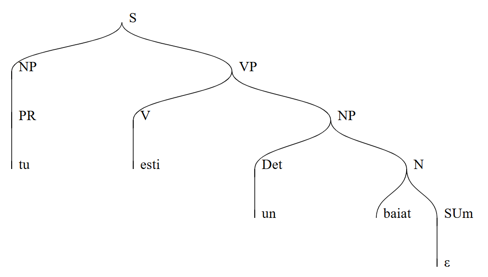
<!--  -->

2. the child loves the dog -> copilul iubeste cainele
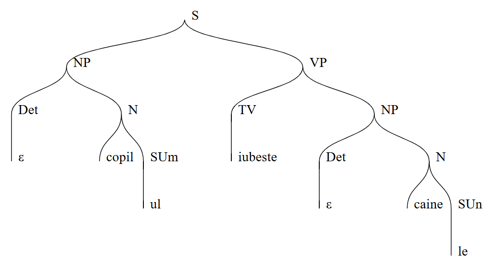
<!--  -->

## UPDATES MADE TO DEMONSTRATE UNDERSTANDING OF REMOVING AMGITUITY AND LEFFT RECURSION

### Eliminating Left Recursion

I started with the grammar:

S -> P
P -> P' PH | ε
P' -> P PH
PH -> Det N | PR | V | TV | P | ε
Det -> o | un | ε  
N -> copil SUm | baiat SUm | caine SUn | fata SUf | carte SUf  
PR -> eu | tu | el | ea  
V -> este | esti | sunt  
TV -> iubeste | cititi | citesc  
SUm -> ul | ε  
SUf -> a | ε  
SUn -> le | ε  

Which can parse a complete sentence like: 

                                  copil este un baiat
S->P->P'->P->ε, Det N->Det->ε, N->copil, P->P->P'->V->este, P->P->P'->Det N->Det->un, N->baiat, P->ε

However, it could also go on forever, if when the first P calls P', and P' calls P, and so on 
infinitely. This is a case of indirect left recursion, which should be eliminated from any functional
grammar.

So a simple fix is to just simply remove the P' rule, and change the P rule to:

P -> PH PH PH

and also remove P from the PH rule.

So that a phrase , which is a sentence, is limited to just 3 phrases, which works for our SVO model.
It means we can have a PH for the Det N (determinate and noun) or for the PR (pronoun), a PH for the V (verb) or TV (type verb), and a third PH for the object, which is another Det N.

And so the grammar ends up like:

S -> P
P -> PH PH PH
PH -> Det N | PR | V | TV | ε
...

This way, the P rule isn't indirectly calling itself potentially infinite times, left recursion is eliminated, and the grammar is now scoped to 3 phrases.

### Eliminating Ambiguity

Now the grammar can parse up to 3 PHs, or phrases. Any combination of the PHs is correctly parsed:

este baiat eu iubeste (is boy he loves),
este esti esti este (is are are is)

But this is not satisfactory. We are allowing incorrect Romaninan grammar to be parsed, we have practically no limits on what can be parsed.

<!-- In fact this grammar is ambigous, because you can derive the same string of words various ways.

For example, the sentence: copil ul este un baiat. (the child is a boy)

S->P->PH->Det->ε, N->copil, SUm->ul, P->PH->V->este, P->PH->Det N-> Det->un, N->baiat, P->ε. -->

So we need to better define what our phrases can be. The PH contained the phrases for subjects (Det N) and (PR), and the phrases for verbs (V) and (TV). 

So we can start by making the P rule have only two phrases, one for the subject of the sentence, and one for the verb phrase of the sentence. We replace the PH line with the two lines that break it into it's parts:

S -> P
P -> NP VP  
NP -> Det N | PR  
VP -> V | TV NP  

And this way, we end up with a grammar that actually puts an order to the phrases, expecting a Noun phrase NP first, and then a verb phrase VP, which can produce either a solo verb V or dependent verb TV along with another noung phrase.

S -> P
P -> NP VP  
NP -> Det N | PR  
VP -> V | TV NP  
Det -> o | un | ε  
N -> copil SUm | baiat SUm | caine SUn | fata SUf | carte SUf  
PR -> eu | tu | el | ea  
V -> este | esti | sunt  
TV -> iubeste | cititi | citesc  
SUm -> ul | ε  
SUf -> a | ε  
SUn -> le | ε 


<!-- S -> P
P -> P P'
P' -> Det N | PR | V | TV | P | ε

There was no distinction between Noun phrases (NP) and Verb phrases (VP), so technically this could
still produce good sentences like:

          un baiat            este          un baiat
S->P->P'(  Det N   ), P->P'->( V ), P->P'->( Det N  ), P->ε

However, this is super ambigous, and the same sentence could be made in various other ways:

                  un baiat                   este                   un baiat
S->P->P'( P ),P'(  Det N  ), P->P'->ε, P->P'(  V  ), P->P'( P ),P'(  Det N  ), P->ε

So the grammar needed to be adjusted to eliminate this ambiguity. I started by removing the epsilon
empty option from the P' word, which just made the grammar have infinite parsing possibilities, and removing the P from the P' as well, to prevent the P' to be able to call P and therefore itself. So I was left with:

S -> P
P -> P' P
P' -> Det N | PR | V | TV  -->

<!-- 
Ambiguity in a set of production rules is when there are multiple ways to parse the input 
string, creating different trees with identical results. An example could be if somehow, 
with an input string of 'she is a girl', there were two or more ways of parsing the input 
to arrive at that string.
[Ambiguous Grammars](https://www.geeksforgeeks.org/ambiguous-grammar/) -->


<!-- Common ambiguities seem to be:
1. When the possibilities of a non-terminal all start with the same terminal: A -> aB | aC, in which you would need left factoring to fix it:
 
- 'In left factoring, we separate the common prefixes from the production rule'
- You end up with A -> aA' ; B -> b ; C -> c
- [Left Factoring](https://www.naukri.com/code360/library/left-factoring-in-compiler-design) -->

<!-- 2. If the same non-terminal appears in both the FIRST and FOLLOW set of a non-terminal.
However, with my grammar, that is not the case:
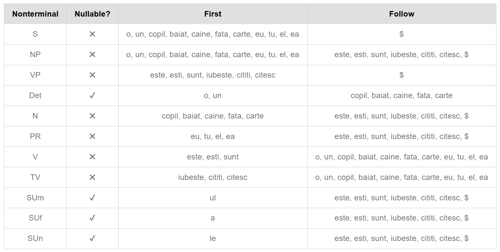 -->
<!--  -->

<!-- Fortunately in my case, there is no instance of the possibility of parsing the same input two 
different ways, as due to its simple attempt at modeling basic and very defined romanian 
sentence structure, there isn't a whole lot of room for ambiguity. However, for a grammar 
aimed at defining mathematical operations, it might be less easy to avoid. -->
 

<!-- ### Eliminating Left Recursion

Left recursion in a grammar is when a non-terminal calls itself as the first thing it produces,
which leads to an infinite loop and no progres (direct), or if the flow of non-terminals arrives 
back at itself, again, without having actually parsed anything.
[Removing Left Recursion](https://www.geeksforgeeks.org/removing-direct-and-indirect-left-recursion-in-a-grammar/)

I made the following diagrams to illustrate these two kinds of left recursion: -->

<!-- 1. Direct Left Recursion  
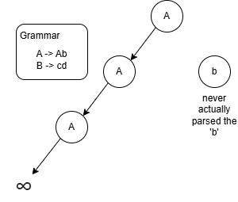
<!--  -->

<!-- 2. Indirect Left Recursion  
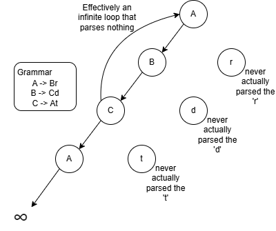
<!--  -->

<!-- In my case, once again, there is no present left recursion. There's never even a case in which
a single path can encounter the same non-terminal twice, the current grammar is very finite.

Even if I added recursivity, by allowing compound sentences using words like 'and' or 'or',
and permitting that a sentence may have multiple SVO components, there is still no instance
in which left recursion is a problem: --> --> -->

<!-- S -> NP VP **C**           // new non-terminal 'C' for conjunction  
NP -> Det N | PR  
VP -> V | TV NP  
C -> C' NS                 // new line  
C' -> si | sau             // new line  
NS -> NP | S               // new line  
Det -> o | un | ε  
N -> copil SUm | baiat SUm | caine SUn | fata SUf | carte SUf  
PR -> eu | tu | el | ea  
V -> este | esti | sunt  
TV -> iubeste | cititi | citesc  
SUm -> ul | ε  
SUf -> a | ε  
SUn -> le | ε   -->

<!-- Despite it now being recursive in that a sentence can, through a conjunction, arrive at a whole 
new sentence, it is not left recursive because there is progress being made before it arrives at 
itself again, as demonstrated with the following example:  

    the dog is a boy or the dog is a girl -> cainele este un baiat sau cainele este o fata

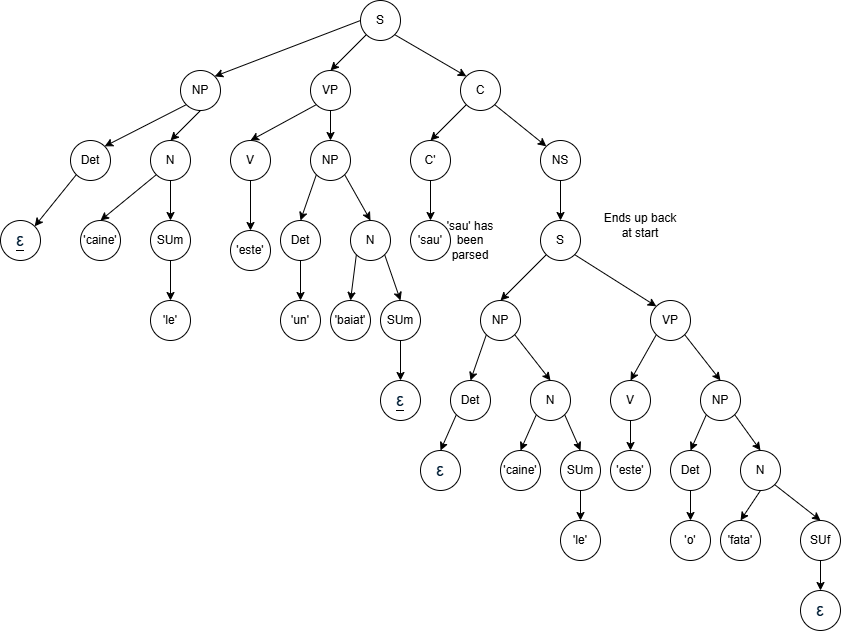 -->
<!--  -->

## Implementation

In order to test this grammar, the declarative programming language Prolog, which many consider
to be a built in parser with its rule-and-fact-setting ability and which was originally programmed
to write natural language applications, will be used to define the production rules of the grammar
in the 'romania.pl' file.

    ```prolog
    s --> np, vp.
    np --> det, n.
    np --> pr.
    vp --> v, np.
    vp --> tv, np.
    det --> [o].
    det --> [un].
    det --> [].
    n --> [copil], sum.
    n --> [baiat], sum.
    n --> [caine], sun.
    n --> [fata], suf.
    n --> [carte], suf.
    pr --> [eu].
    pr --> [tu].
    pr --> [el].
    pr --> [ea].
    v --> [este].
    v --> [esti].
    v --> [sunt].
    tv --> [iubeste].
    tv --> [cititi].
    tv --> [citesc].
    sum --> [ul].
    sum --> [].
    sun --> [le].
    sun --> [].
    suf --> [a].
    suf --> [].
    ```

This is actually a special syntax offered by prolog specifically for context-free grammar construction.

Then a manual tester and automated tester will be written:

    ```prolog
        % succeeds if parsing succeeds
    test_true(Sentence) :-
        phrase(s, Sentence),
        format("✅ Success (expected true): ~w~n", [Sentence]).

    % succeeds if parsing fails
    test_false(Sentence) :-
        \+ phrase(s, Sentence),
        format("✅ Success (expected false): ~w~n", [Sentence]).
    ```
    These tests you can use to manually test a sentence you expect to pass or fail:
    ?- test_true([this, is, a, test]). (should give fail)

    ?- test_false([this, is, a, test]). (should give true).

    ```prolog
    run_tests :-
        % Expected to succeed
        test_true([tu, esti, un, baiat]),
        test_true([eu, sunt, un, baiat]),
        test_true([copil, ul, iubeste, caine, le]),
        test_true([ea, este, o, fata]),
        test_true([tu, cititi, fata, a]),
        test_true([un, caine, este, un, baiat]),
        test_true([eu, citesc, ea]),
        % Expected to fail
        test_false([un, baiat]),                          % incomplete, no verb phrase
        test_false([]),                                   % empty string
        test_false([ea, carte, sunt]),                    % 'she book am', NP does not allow pronoun-noun
        test_false([sunt, un, caine]),                    % 'am a dog', no noun phrase to begin
        test_false([un, iubeste, o, carte]),              % 'a loves a book', no noun to accompany article
        test_false([un, sunt]),                           % 'a am', no noun to accompany article
        test_false([o, fata, ea, este, o, fata]).         % 'a girl she is a girl', NP does not allow article + noun and pronoun
    ```

This is so that the user can simply run a set of predefined tests and see 
whether the strings are successfully parsed or not, which can be run with:
?- run_tests.

## Test

The automated test, 'run_tests.' produces the following:

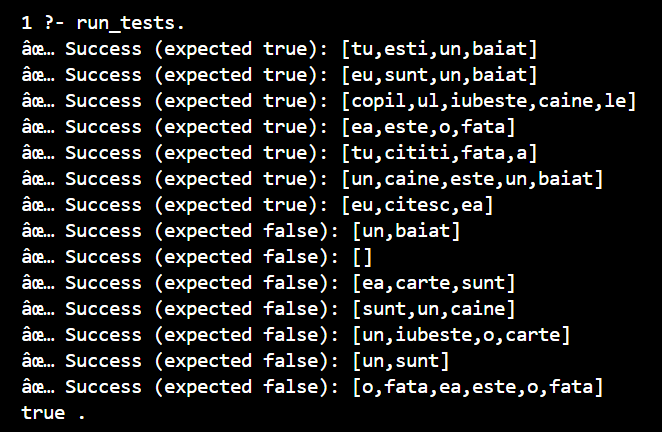
<!--  -->

All the tests were successful. Here are the actual parse trees, made with the LL1 parser of princeton, of an example of both an expected pass test and expected fail test, to visualize why they pass/fail:
[Princeton LL1 Sim](https://www.cs.princeton.edu/courses/archive/spring20/cos320/LL1/)

1. Expected pass sentence: 'copilul este o fata' (the child is a girl)
* Manual Test In Prolog:  
** 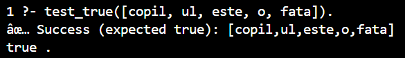
<!-- **  -->
* Parse Tree:  
** 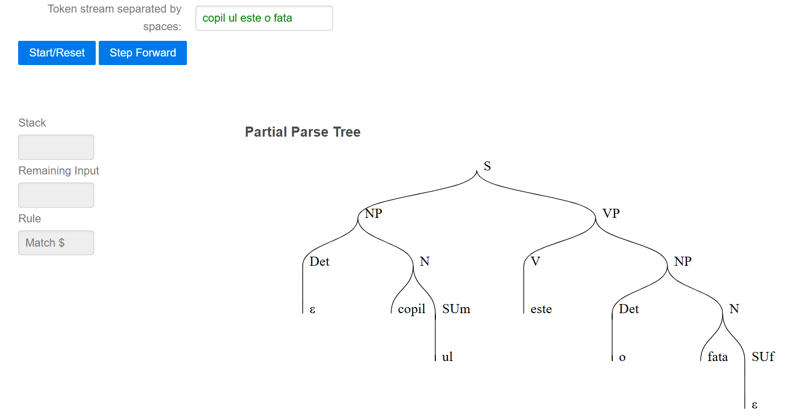
<!-- **  -->
* Result: The string was parsed successfully and reached the end.

2. Expected fail sentence: 'o fata iubeste' (a girl loves)
* Manual Test In Prolog:  
** 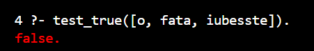
<!-- **  -->
* Parse Tree:  
** 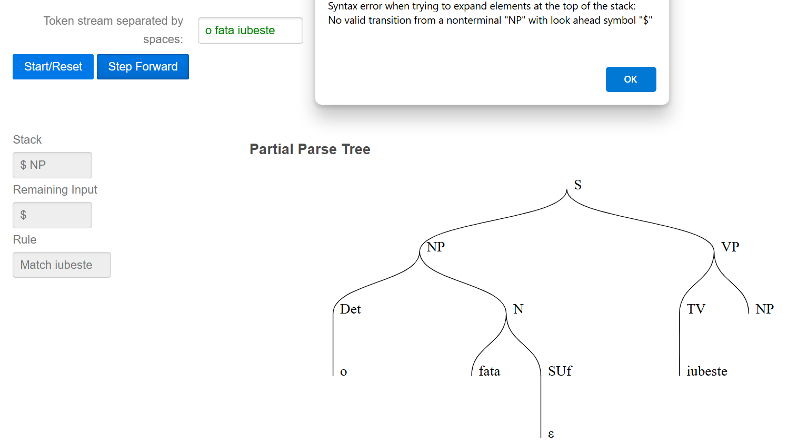
<!-- **  -->
* Result: The input string caused an error, due to it reaching the end without satisfying the 
full requirements of language in the VP -> NP part.

Both the manual tests in prolog and LL1 tree parser confirm that the sentences were parsed, 
or not parsed, as expected.

## Analysis

The grammar, prior to being checked for ambiguity and left recursion, was a type 2
language in that it followed the correct left-hand side and right-hand side rules
for context-free grammars.

However, if there were a ambiguity or left recursion, then that could mean a failing 
in the compilation, or an infinite useless loop, which are necessary to remove before 
the grammar can be a *functional* context-free grammar.

In fact, all the language types have rules for how their production rules can be written, 
which ultimately decide how restrictive they are on the input that they can parse, and 
therefore their potential time complexity:

0. Recursively Enumerable (Type-0) – Turing Machine (Least Restrictive)

* No real restrictions on production rules, as long as the left side contains at least one variable.

 * Example: Sab → ba

* Can generate any computable language, but may run forever without halting.

* Parsing is undecidable in general.

1. Context-Sensitive Grammar (Type-1) – Linear Bounded Automaton

* Rules must not shrink the string: the output must be at least as long as the input.

* Example:
A → BA  
B → ABc  

* More powerful than context-free grammars.

* Parsing is possible but may take a lot of space (PSPACE complexity).

2. Context-Free Grammar (Type-2) – Pushdown Automaton

* Each rule replaces a single variable with any string of terminals and/or variables.

* Example: S → aSb | ε

* Common for programming languages and arithmetic expressions.

* Parsing is often O(n³) (or faster with optimized algorithms).

3. Regular Grammar (Type-3) – Finite Automaton (Most Restrictive)

* Rules can only produce one terminal followed by a variable (or just a terminal).

* Example:

S → aA  
A → bS | ε  

* Great for simple patterns like identifiers, numbers, or tokens.

* Parsing is fast and linear: O(n)

<!-- 0. Recursively Unumerable, uses Turing Machine (least restrictive)
* May look like this: 
** Sab -> ba
* meaning it could go on infinitely parsing the string

1. Context-Sensitive Grammar, uses linear bound automata
* May look like this:
** A -> BA
** B -> ABc
* and with a turing machine, has no limit to how 

2. Context-Free Grammar, uses pushdown automata
* May look like this:
** S -> aSb

* and with a push-down automata, can only only need as much as O(n^3) time complexity

3. Regular Grammar, uses finite automata (most restrictive)
* May look like this:
** 
* and with a  -->

[Chomsky's Hierarchy](https://www.geeksforgeeks.org/chomsky-hierarchy-in-theory-of-computation/)
